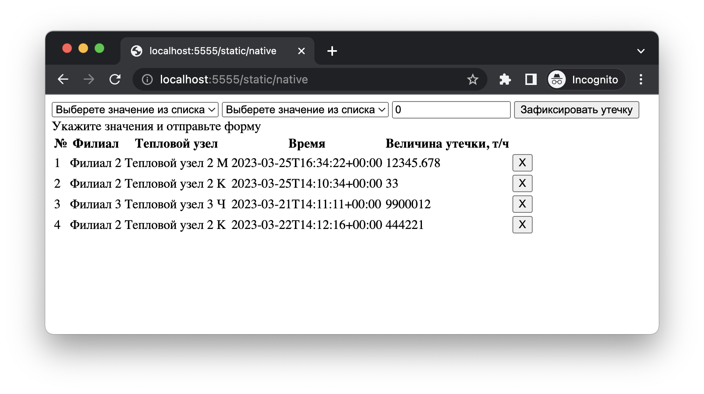
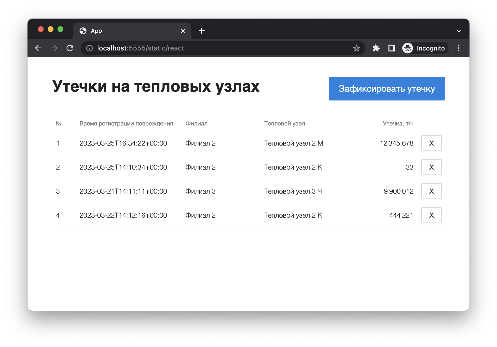
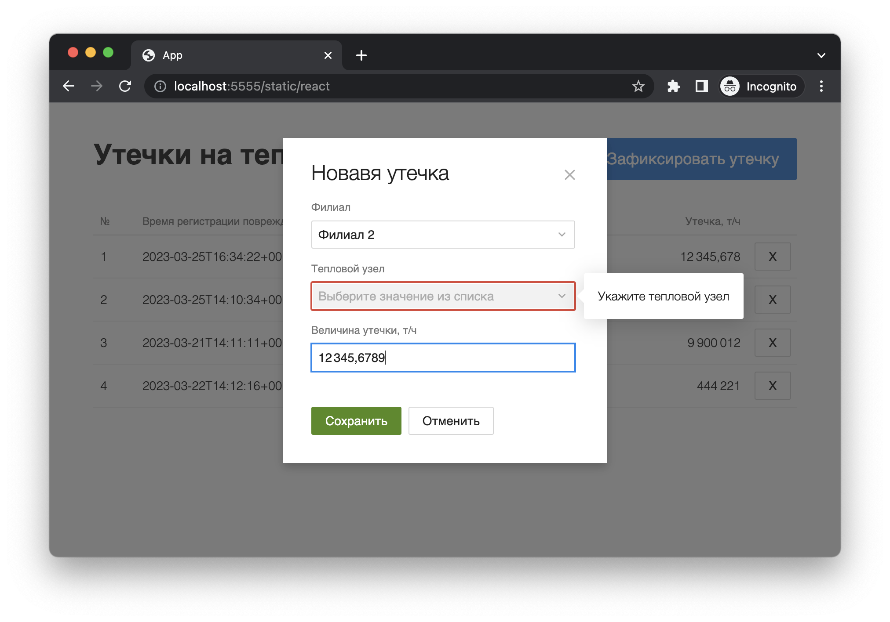
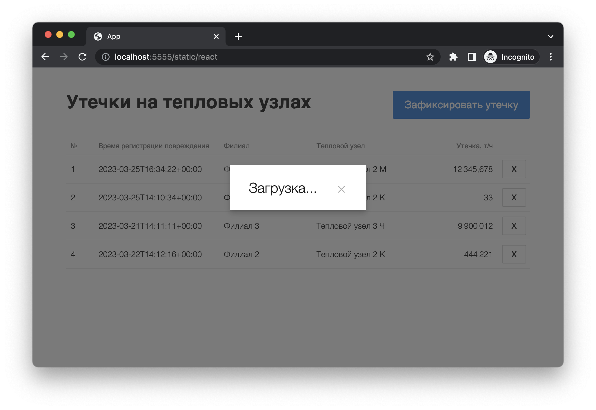
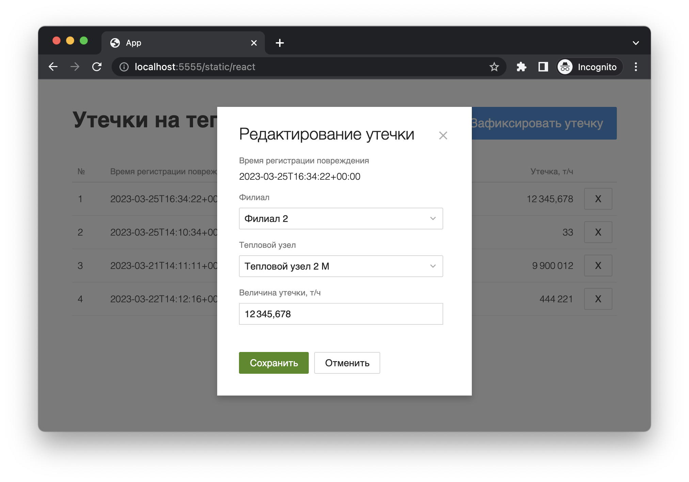
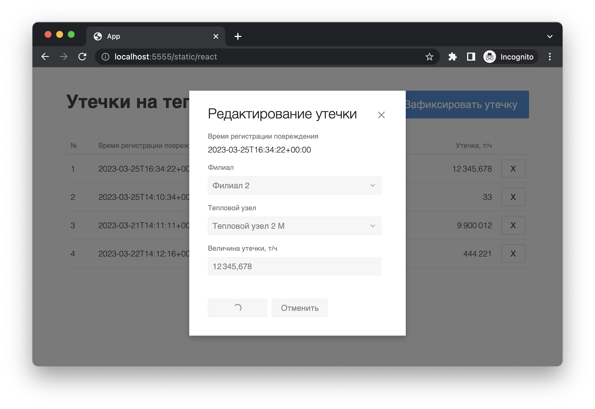

# Старт приложения

Старт сервера

```
php -S localhost:5555
```

Сборка фронта

```
cd front
npm ci
npm run build
```

страница навигации будет доступна тут http://localhost:5555

прямые ссылки:

- http://localhost:5555/static/react - приложение на React.js
- http://localhost:5555/static/native - приложение на HTML+JS
- http://localhost:5555/static/reset - сброс состояния базы данных

# Структура

- api - API хендлеры на PHP
- front - исходный код React.js приложения
- static - статичные HTML страницы
- database.php - работа с базой данных

# Разработка React.js приложения

```
cd front
npm ci
npm start
```

# База данных

В качестве базы данных использовано SQLite хранилище, файл db.db

База данных создается автоматически и наполняется тестовыми данными

Для сброса в начальное состояние нужно удалить файл или открыть страницу http://localhost:5555/static/reset

# Скриншоты

### HTML + JS



### React.js









